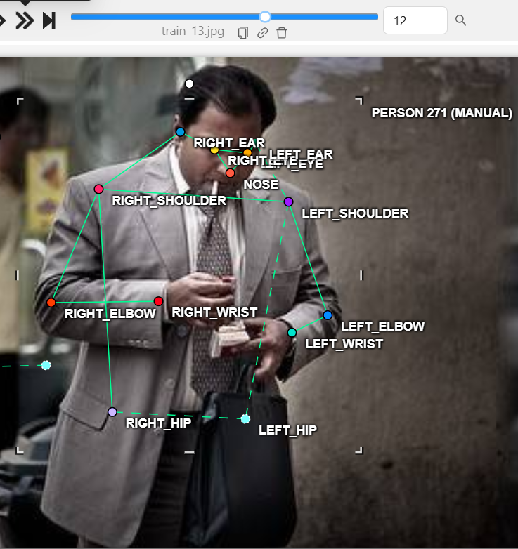
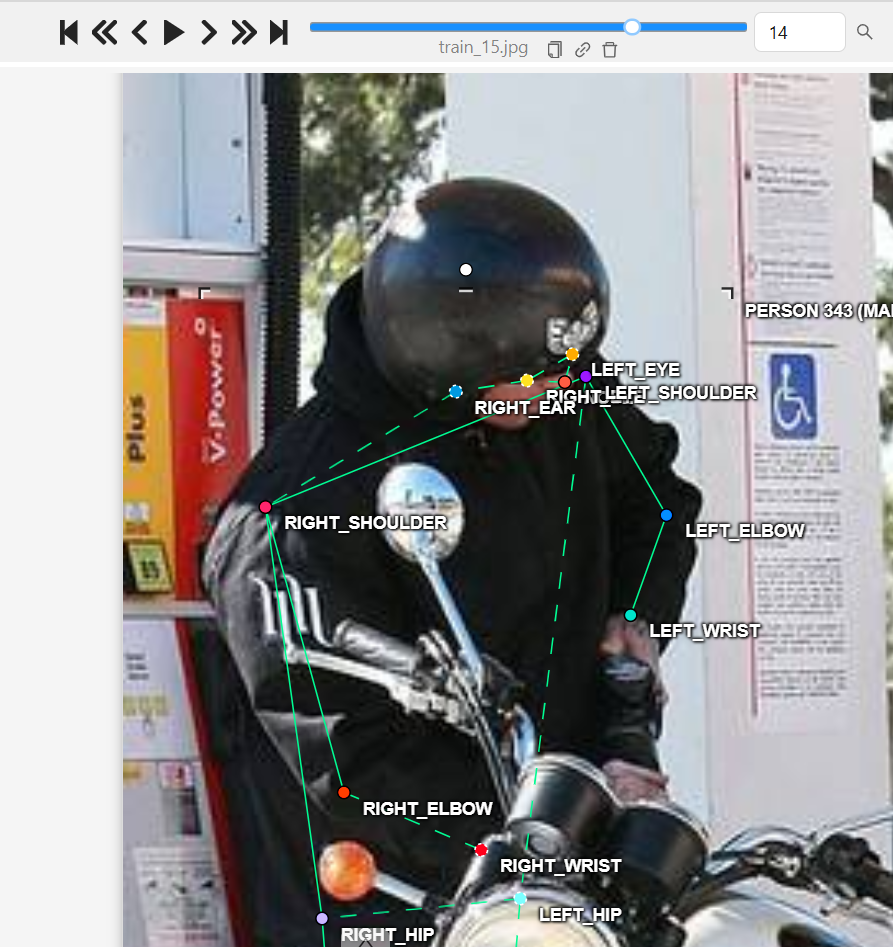
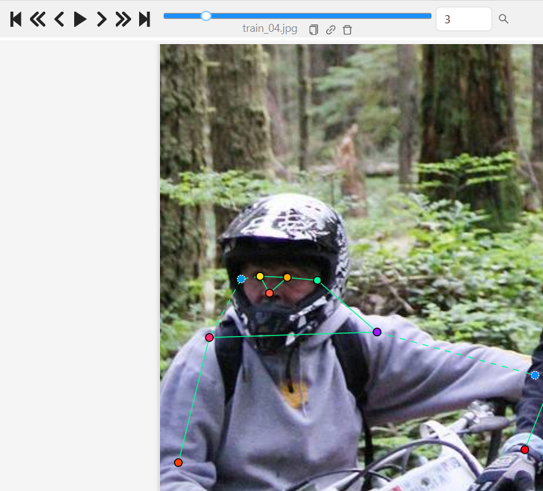
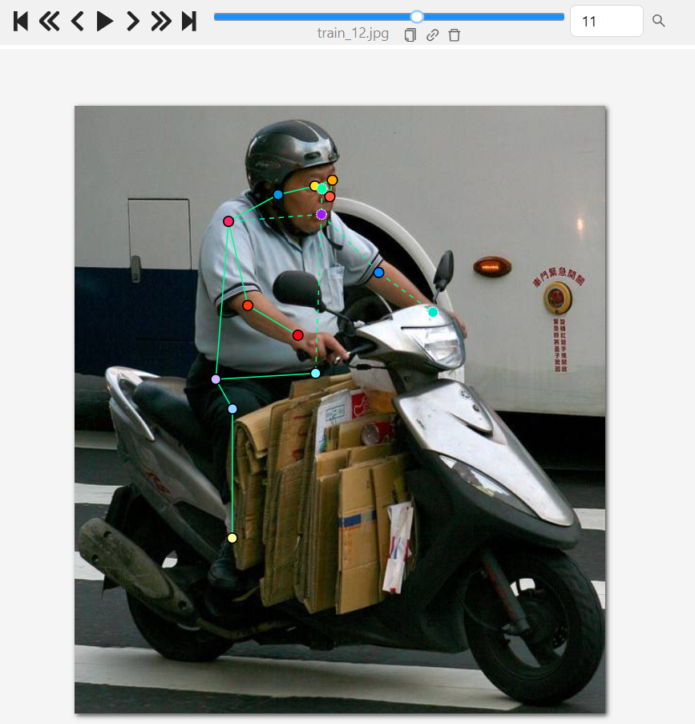
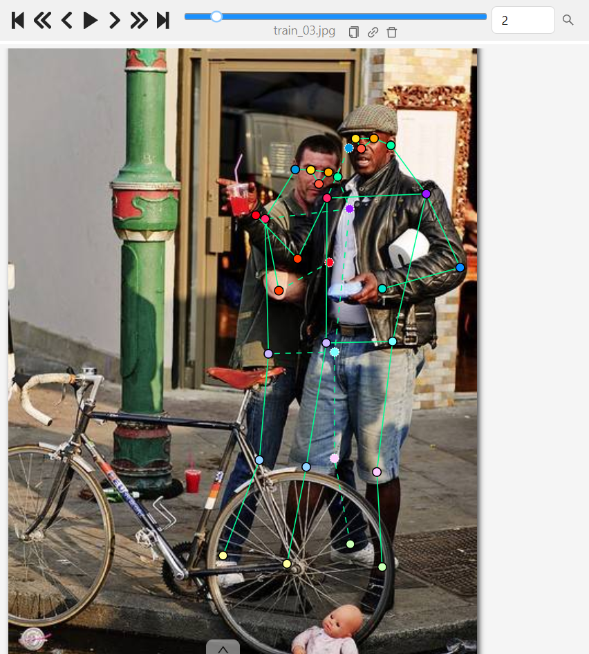
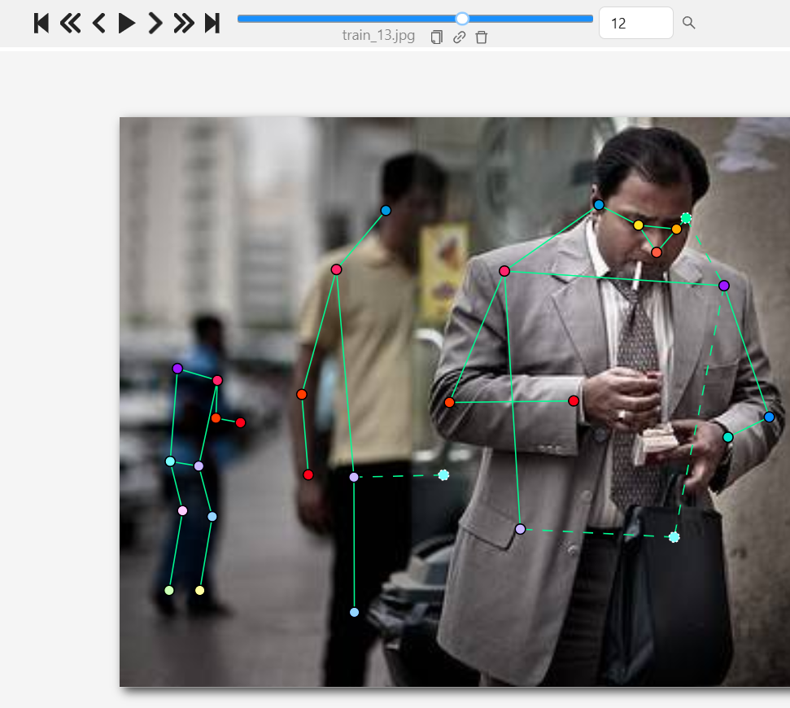

# Mini guideline - Người gán: Hoàng Gia Linh  |  ngày: 26/09/2026

> Điền file này **trong lúc** gán nhãn, không phải sau khi xong. Mỗi lần bạn dừng lại
> hơn 10 giây để phân vân, đó là một dòng phải ghi vào đây.

## 1. Luật bắt buộc (đã thống nhất cả lớp - không sửa)

- Bộ 17 điểm COCO, đúng tên, đúng thứ tự. Lấy từ file .SVG chung.
- Mọi người trong ảnh đều có **đủ 17 điểm**. Điểm không dùng được thì gắn cờ, không xoá.
- Trái/phải tính theo **cơ thể người**, không theo bức ảnh.
- Bị che, còn trong khung -> v = 1, **vẫn đặt chấm** ở vị trí ước lượng.
- Ra ngoài mép ảnh -> v = 0, **không** đặt chấm.
- Không dùng Hidden (h) - nó không được lưu vào file.

## 2. Luật của nhóm bạn (phải điền)

| Tình huống | Luật nhóm bạn chọn | Vì sao |
| --- | --- | --- |
| Hông của người mặc quần áo dài | **Gắn cờ v = 1 (Occluded) & Đặt chấm ước lượng**  |  Dù bị áo/quần dài che khuất bề mặt, khớp vẫn thuộc khung hình nên phải đặt chấm ước lượng và bật cờ v = 1 để giữ đủ 17 điểm COCO, giúp model học đúng bộ xương tổng thể. |
| Tai bị tóc hoặc mũ bảo hiểm che một phần | **gắn cờ v = 1 (Occluded) & Đặt chấm ước lượng**| Tai nằm trên đầu vẫn nằm trong khung hình. gắn cờ v = 1 giữ nguyên bộ 5 điểm khuôn mặt, tránh đứt đoạn phần đầu và tuân thủ nguyên tắc không xoá/bỏ điểm khi đối tượng còn trong khung ảnh|
| Người bị cắt ở mép ảnh (chỉ thấy từ hông trở lên) | **Khớp trong khung:** Gán bình thường (v = 2 hoặc v = 1). **Khớp chân bị cắt ra ngoài mép ảnh:** gắn cờ v = 0 (Outside) và **không đặt chấm**. | Khớp ra ngoài mép ảnh (v = 0) tuyệt đối không đoán bừa hay đặt chấm ngoài khung. Đặt v = 0 giúp model học nhận diện mốc cắt mép ảnh (crop) để không bị phạt điểm hoặc đoán sai tư thế. |
| Cổ tay nằm sau tay lái / sau thân mình | **gắn cờ v = 1 (Occluded) & Đặt chấm ước lượng** tại vị trí cổ tay ẩn (nối tiếp cẳng tay hướng về tay cầm/lưng). | Cổ tay bị vật thể (tay lái, áo, lưng) che khuất nhưng bộ tay vẫn ở trong khung hình. Đặt chấm v = 1 giúp duy trì liên kết xương cẳng tay - bàn tay, tránh đứt gãy skeleton cánh tay. |
| Hai người chồng lên nhau | **Gán lần lượt từng người (Skeleton riêng).** Các khớp của người bị che lấp nếu còn trong khung thì vẫn đặt chấm ước lượng và chọn v = 1 (Occluded). | Phân tách rõ skeleton từng người giúp tránh lỗi nghiêm trọng chéo xương sang người bên cạnh. Sử dụng v = 1 giúp model nhận diện đúng các trường hợp va chạm/che lấp trong đám đông. |
| Người nhỏ đến mức nào thì không gán nữa | **Gán tất cả người phân biệt được cấu trúc cơ thể (đầu, thân, chân/tay).** Chỉ bỏ qua nếu quá nhỏ/mờ (< 10-15px) thành đốm nền không rõ dạng. | 20 ảnh thực hành được thiết kế để mọi người đều đủ lớn để gán.  |

### Minh hoạ ảnh mẫu CVAT cho các luật (Cần chụp & chèn ảnh từ CVAT của nhóm):

1. **Hông bị che bởi quần áo dài:**
   
   *Ghi chú: Đặt chấm tại vị trí mấu chuyển lớn xương đùi ước lượng, bật cờ Occluded (v=1).*

2. **Tai bị tóc / mũ che một phần:**
   
   *Ghi chú: Đặt chấm tại tâm tai giải phẫu ước lượng, bật cờ Occluded (v=1).*

3. **Người bị cắt ở mép ảnh:**
   
   *Ghi chú: Khớp chân nằm ngoài mép ảnh bật cờ Outside (v=0), không đặt chấm.*

4. **Cổ tay nằm sau tay lái / thân mình:**
   
   *Ghi chú: Ước lượng vị trí cổ tay khuất sau tay lái/thân người, bật cờ Occluded (v=1).*

5. **Hai người chồng lên nhau:**
   
   *Ghi chú: Gán skeleton riêng cho từng người, khớp bị che lấp gắn cờ v=1.*

6. **Giới hạn kích thước người nhỏ:**
   
   *Ghi chú: Gán đủ skeleton cho người nhỏ nếu vẫn nhận diện rõ cấu trúc đầu - thân - chân.*

## 3. Ba ca mơ hồ đã gặp (bắt buộc, ghi ít nhất 3)

### Ca 1 - ảnh train_06.jpg, người thứ 1, khớp khuôn mặt & cánh tay phải

- Mơ hồ ở chỗ nào: Ảnh chụp từ sau lưng, người điều khiển xe bị mũ bảo hiểm trùm kín hoàn toàn khuôn mặt, tay phải và chân bị che khuất hẳn không rõ điểm đặt.
- Bạn quyết thế nào: gắn cờ v = 0 (Outside/không đặt chấm) cho các khớp khuôn mặt không lộ vết tích và cánh tay bị che mất hoàn toàn; ước lượng vị trí hông giải phẫu và đặt v = 1.
- Vì sao: Mũ bảo hiểm trùm kín không còn dấu vết thị giác để xác định vị trí mắt/mũi/tai chính xác. Dùng v = 0 theo đúng nguyên tắc không đoán bừa khi hoàn toàn mất mốc bằng chứng.
- Nếu người khác quyết ngược lại thì model học sai cái gì: Nếu ép đặt v = 1 ở chỗ bị vật che phủ đục (opaque obstruction) mà không có mốc tham chiếu, model sẽ học cách đoán mò điểm khuôn mặt ở các vị trí ngẫu nhiên trên mũ bảo hiểm.

### Ca 2 - ảnh train_04.jpg, người thứ 2, khớp hông và chân

- Mơ hồ ở chỗ nào: Ảnh người này bị cắt ở mép ảnh, chỉ hiện rõ phần thân trên, khớp hông và chân bị cắt ra ngoài mép ảnh
- Bạn quyết thế nào: Xác định các khớp nhìn thấy, ước lượng theo hướng xương cơ thể còn lại thì khớp hông đã nằm ngoài ảnh, các khớp chân cũng vậy -> Chọn v = 0 (Outside) cho các khớp hông và chân.
- Vì sao: Khớp hông và chân nằm ngoài phạm vi khung hình, không có dấu vết thị giác để ước lượng -> không đặt chấm.
- Nếu người khác quyết ngược lại thì model học sai cái gì: Nếu chọn v = 1 (Occluded) và đặt chấm, model sẽ học cách đoán mò vị trí khớp hông/chân bị cắt ra ngoài, dẫn đến việc khớp này bị dự đoán sai khi test trên ảnh thực tế.

### Ca 3 - ảnh train_03.jpg, người thứ 2, khớp vai và hông trái

- Mơ hồ ở chỗ nào: Người này đứng sát và đằng sau nên bị che khuất phần bên phải bởi người đằng trước
- Bạn quyết thế nào: Dựa vào phần khớp đầu gối và cổ chân, và phần khớp bên phải có thể ước lượng vị trí vai và hông trái, đặt chấm ước lượng và chọn cờ v = 1 (Occluded).
- Vì sao: Các khớp vai và hông nằm trong phạm vi khung hình. Việc bị người phía trước che khuất là che khuất vật lý trong khung, phải tuân thủ gán v = 1 thay vì v = 0.
- Nếu người khác quyết ngược lại thì model học sai cái gì: Nếu chọn v = 0, model sẽ tưởng khớp vai/hông bị văng ra ngoài mép ảnh, dẫn đến lỗi xoá khớp bị che (xoa_khop_bi_che) và làm đứt đoạn skeleton cánh tay của người lái xe.

## 4. Sau khi so visibility report với bạn cùng nhóm (Bài tập lab buổi 4 chỉ thực hiện làm cá nhân theo hướng dẫn lab coach, không tiến hành kiểm chéo)

- Khớp lệch %v=1 nhiều nhất: 
- Nguyên nhân là **guideline chưa rõ** hay **một trong hai bên gán sai**: 
- Luật mới bổ sung vào mục 2 sau khi thống nhất: 
